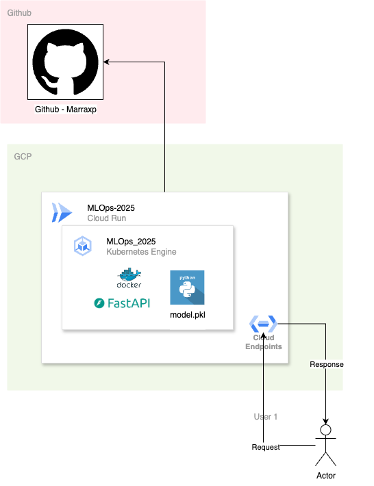
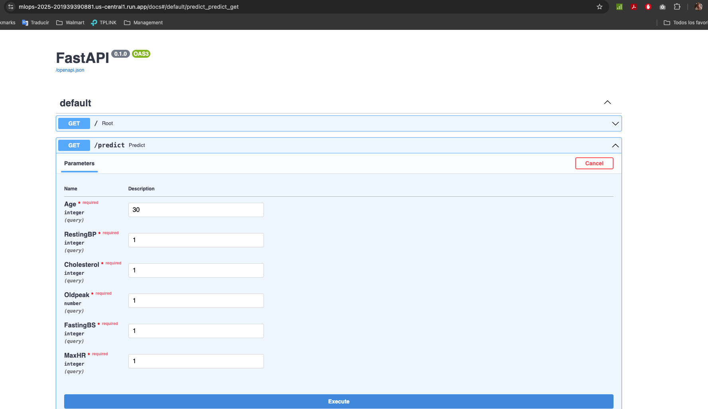
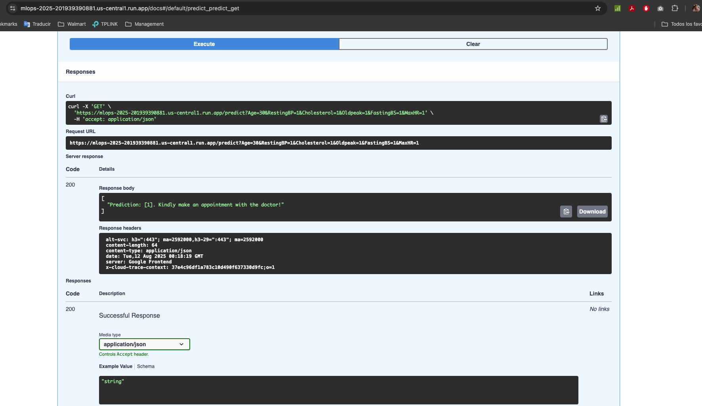
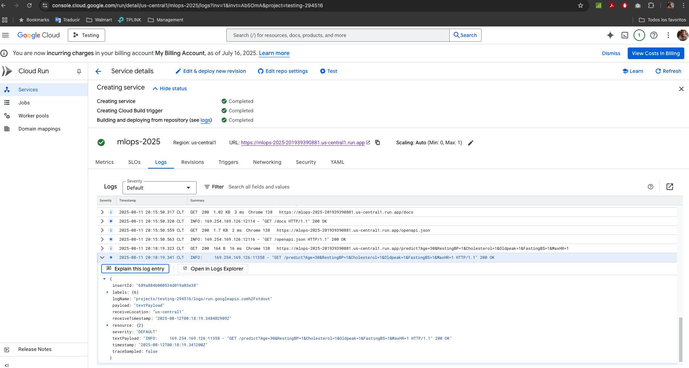

# API para MLOps

[](https://opensource.org/licenses/Apache-2.0)

Esta es una aplicacion que predice dado unos indicadores de salud, si debe ir o no al doctor a revisarse.

La App está distribuida por el siguiente repositorio: https://github.com/madxerax/mlops_2025

La finalidad de esta entrega es hacer el flujo de MLOps, por lo cual no ahondaremos en gran detalle en la App, pero si en el flujo que se realizó para desplegar y disponibilizar la API.

Este trabajo es parte del entregable del curso de MLOps Sec.2 - 2025 del [Magister en Data Science](https://www.uai.cl/postgrados/magisteres/magister-en-data-science) de la Universidad Adolfo Ibañez.


- Profesor: [Ahmad Armoush](https://www.uai.cl/profesores/ingenieria-y-ciencias/ahmad-armoush)
- Alumno: [Mariano González Núñez](https://www.linkedin.com/in/marianogn/)


## Tabla de Contenidos

- [App para MLOps](#App-para-MLOps)
  - [Tabla de Contenidos](#tabla-de-contenidos)
  - [Descripción General Uso App](#descripcion-general-uso-app)
  - [Arquitectura](#arquitectura)
  - [Deploy](#deploy)
    - [Test](#test)
    - [Prod](#prod)
  - [Anexos](#anexos)
    - [K8s Deploy](#k8s-deploy)

## Descripción General Uso App

La App esta diseñada con FastAPI en Python.

La API se levanta en el puerto 8080 e importante para entrar a ella se debe usar un GET request a /predict con un json request, señalando la edad y los valores médicos necesarios para predecir.

```json
{
    'Age': 68,
    'Cholesterol': 195,
    'Oldpeak': 0.0,
    'FastingBS': 1,
    'RestingBP': 150,
    'MaxHR': 132,
}
```

## Arquitectura

Se utilizó la Arquitectura de GitHub > GCP en CloudRun > Kubernetes corriendo la API.



## Deploy

- La App fue provista junto a todos los archivos necesarios para correrla.
- Se generó un Dockerfile que permite levantar la App.py con Python 3.10 y sus respectivos paquetes contenidos en un requirements.txt en el puerto 8080 con uvicorn.


### Test

- Se generó la imagen en un ambiente local (Docker Desktop).

  ```sh
  docker build -t mlops_2025 .
  ```
- Se deployó la imagen dentro del ambiente local y luego se probó que funcionara correctamente.

  ```sh
  docker run --name mlops_2025_cont -p 8080:8080 mlops_2025

  ```
- Se levantó en el navegador en la ruta localhost:8080/docs y ahi utilizando el tryout en el GET /predict se ejecutó el modelo la API.

  
- Se puede apreciar que entregó un 200 como response y la prediccion en el body del response.

  


### Prod

- Se generó un Cloud Run en GCP, donde se levanto el repositorio de GitHub y la App con la siguiente ruta:
  [API en GCP](https://mlops-2025-201939390881.us-central1.run.app/docs).

  
- Luego de compilar, se procedió a probar la API en el navegador

  
- Se procedió a probar si funciona el Request.

  
  
- Se revisó en el log de Cloud Run en GCP que todo funcione bien

  


## Anexos

### K8s Deploy GCP

- Se deja el Deploy de Kubernetes que dejo CloudRun para la API.

```yaml
apiVersion: serving.knative.dev/v1
kind: Service
metadata:
  name: mlops-2025
  namespace: '201939390881'
  selfLink: /apis/serving.knative.dev/v1/namespaces/201939390881/services/mlops-2025
  uid: b230e325-808d-48ab-ae6d-b069705835cc
  resourceVersion: AAY5+mie2Tg
  generation: 5
  creationTimestamp: '2025-07-15T16:24:46.734668Z'
  labels:
    commit-sha: 138e90befd9eb443714a345cd84c0465a9d18673
    gcb-build-id: d3484c46-ba64-4f3b-a1cb-1cc5253fe569
    gcb-trigger-id: d72165c5-bf37-4b09-b5bf-7ce7c9da0565
    gcb-trigger-region: global
    managed-by: gcp-cloud-build-deploy-cloud-run
    cloud.googleapis.com/location: southamerica-west1
  annotations:
    serving.knative.dev/creator: mariano.g.n@gmail.com
    serving.knative.dev/lastModifier: mariano.g.n@gmail.com
    run.googleapis.com/client-name: cloud-console
    run.googleapis.com/launch-stage: BETA
    run.googleapis.com/operation-id: 6cf3a3f2-08e7-4398-a810-5fbf9b208946
    run.googleapis.com/ingress: all
    run.googleapis.com/ingress-status: all
    run.googleapis.com/invoker-iam-disabled: 'true'
    run.googleapis.com/maxScale: '1'
    run.googleapis.com/urls: '["https://mlops-2025-201939390881.southamerica-west1.run.app","https://mlops-2025-d5rjrjg47q-tl.a.run.app"]'
spec:
  template:
    metadata:
      labels:
        client.knative.dev/nonce: 412ea943-88b3-437c-859b-884dcb81be81
        commit-sha: 138e90befd9eb443714a345cd84c0465a9d18673
        gcb-build-id: d3484c46-ba64-4f3b-a1cb-1cc5253fe569
        gcb-trigger-id: d72165c5-bf37-4b09-b5bf-7ce7c9da0565
        gcb-trigger-region: global
        managed-by: gcp-cloud-build-deploy-cloud-run
        run.googleapis.com/startupProbeType: Default
      annotations:
        autoscaling.knative.dev/maxScale: '2'
        run.googleapis.com/client-name: cloud-console
        autoscaling.knative.dev/minScale: '1'
        run.googleapis.com/startup-cpu-boost: 'true'
    spec:
      containerConcurrency: 80
      timeoutSeconds: 300
      serviceAccountName: 201939390881-compute@developer.gserviceaccount.com
      containers:
      - name: placeholder-1
        image: southamerica-west1-docker.pkg.dev/testing-294516/cloud-run-source-deploy/mlops_2025/mlops-2025:138e90befd9eb443714a345cd84c0465a9d18673
        ports:
        - name: http1
          containerPort: 8080
        resources:
          limits:
            cpu: 4000m
            memory: 2Gi
        startupProbe:
          timeoutSeconds: 240
          periodSeconds: 240
          failureThreshold: 1
          tcpSocket:
            port: 8080
  traffic:
  - percent: 100
    latestRevision: true
status:
  observedGeneration: 5
  conditions:
  - type: Ready
    status: 'True'
    lastTransitionTime: '2025-07-15T16:38:40.111928Z'
  - type: ConfigurationsReady
    status: 'True'
    lastTransitionTime: '2025-07-15T16:38:38.847904Z'
  - type: RoutesReady
    status: 'True'
    lastTransitionTime: '2025-07-15T16:38:40.075736Z'
  latestReadyRevisionName: mlops-2025-00004-ktn
  latestCreatedRevisionName: mlops-2025-00004-ktn
  traffic:
  - revisionName: mlops-2025-00004-ktn
    percent: 100
    latestRevision: true
  url: https://mlops-2025-d5rjrjg47q-tl.a.run.app
  address:
    url: https://mlops-2025-d5rjrjg47q-tl.a.run.app
```

